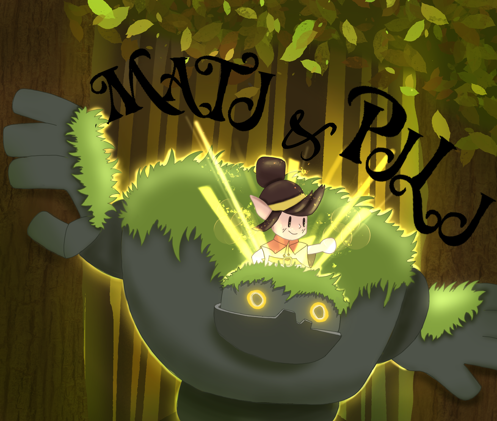

# Mati & Pili

En lo más profundo de una tranquila selva habita Pili, una gigante piedra que custodia la tranquilidad de la naturaleza. Un día, se encuentra con Mati, un niño perdido. Aunque no comparten ni palabras, pronto descubren una gran conexión entre ellos; Pili escucha los pensamientos de Mati, y Mati siente la selva a través de Pili.
Juntos emprenden un viaje para devolver la luz a los santuarios del bosque, apagados por el mundo exterior.

## Índice
1. [Integrantes](#integrantes)
2. [Introducción](#introducción)
3. [Narrativa](#narrativa)
4. [Personajes y mecánicas](#personajes-y-mecánicas)
5. [Escenarios](#escenarios)
6. [Niveles](#niveles)
7. [Progreso del juego](#progreso-del-juego)
8. [Música](#musica)
9. [Marketing](#marketing)
10. [Referencias](#referencias)

## Integrantes
Grupo 7

| Nombre | Apellidos      | Correos                                                                   | Cuenta github |
|--------|----------------|---------------------------------------------------------------------------|---------------|
| Olga   | de Llano       | [o.dellano.2023@alumnos.urjc.es](mailto:o.dellano.2023@alumnos.urjc.es)   | OlgaDllb      |
| Samuel | Vega de Seoane | [s.vega.2023@alumnos.urjc.es](mailto:s.vega.2023@alumnos.urjc.es)         | samuvds       |
| Ismael | Garcia         | [i.garciaga.2023@alumnos.urjc.es](mailto:i.garciaga.2023@alumnos.urjc.es) | hiper942      |

## Introducción
Género: 
Plataformas cooperativo 2D

Plataforma: 
Web (cooperativo local)

Público objetivo: 
Todas las edades y amantes de los juegos en parejas.

Controles:

Movimiento de Mati - WASD 

Movimiento de Pili - ↑←↓→

Estilo visual: 

El juego presenta un arte 2D dibujado a mano con un estilo cartoon-naturalista, el cual combina trazos suaves y colores cálidos. La estética se caracteriza por su atmósfera relajada, luminosa y orgánica, reviviendo la calma de un bosque mágico bañado por su luz propia.
Los entornos están formados con tonos verdes, dorados y ocres suaves para reflejar la calidez del bosque.

El estilo visual combina formas redondeadas y simplificadas con detalles texturizados (musgo, raices, madeja, hojas...) que mantienen un visual agradable para todas las edades. 

El resultado final busca un equilibrio entre la estética ilustrada a mano y la claridad visual propia de un videojuego de plataformas cooperativo, asegurandose que los jugadores logren distinguir, sin problemas, los elementos interactivos sin perder la belleza del entorno.

Descripción: 
Mati & Pili es un videojuego de plataformas cooperativo en el cual dos personajes muy distintos entre sí; Mati, un niño curioso y alocado, y Pili, una gigante piedra pacífica; deben avanzar por un bosque mágico resolviendo puzles enfocados en la colaboración, unión de habilidades, altura y tiempo.
El juego combina una lógica, con sincronización y emoción. Se quiere transmitir un mensaje de confianza y unión entre seres diferentes.

Objetivo del diseño: 
Se quiere crear una experiencia cooperativa accesible para todos los públicos, emotiva y visualmente relajada, donde cada nivel logre reforzar un vínculo entre los dos jugadores.

## Narrativa
### Tema
Amistad y cooperación + Naturaleza.

### Tono narrativo
Aventurero y emotivo, con una atmósfera llena de serenidad y tranquilidad.
**NO** hay diálogos, sólo gestos, sonidos ambientales y música emocional que logran transmitir la historia.

## Personajes, Mecánicas y Físicas
### Personajes
#### Mati

Mati es un niño elfo, ágil, curioso y un poco imprudente. Representa la energía, la exploración y la agilidad.
Viste una capa naranja, una bandana y pelo recogido en un moño.

#### Pili

Pili es una gigante piedra con ojos brillantes y movimientos lentos pero firmes. Tiene musgo a lo largo de su lomo, y su tamaño triplica el de Mati. Transmite calma y fuerza.

### Mecánicas
Cada jugador controlará un personaje que tendrá mecánicas únicas que se deberán complementar para superar los desafíos.

#### Mati
##### Habilidades
- Salto alto: puede saltar hasta 2 casillas de altura o longitud.
- Dash: acelera brevemente.
- Interactúa con cristales y mecanismos
- Movilidad Rápida
- Montarse sobre Pili: permite alcanzar zonas altas o protección.

##### Limitaciones
- No puede mover objetos grandes.
- Es mucho más vulnerable que Pili.

##### Uso de puzles
- Accionar mecanismos a los que Pili no puede llegar gracias a su agilidad.
- Pasar por huecos estrechos.

#### Pili
##### Habilidades
- Fuerza bruta: empuja bloques pesados y abre pasajes tapados.
- Salto corto: no puede saltar ni media casilla.
- Plataforma móvil: Mati puede subirse a su lomo.

##### Limitaciones
- Se mueve lentamente.
- No puede pasar por espacios estrechos o pasadizos.
- No puede activar mecanismos complejos de llegar o frágiles.

##### Uso de puzles
- Crear rutas seguras para Mati.
- Sostener interruptores mientras Mati logra su objetivo.
- Formar puentes o escaleras naturales.

### Físicas
El sistema de físicas combina precisión y simplicidad para reforzar la cooperación entre ambos.
Cada uno responde de forma distinta a la gravedad, la inercia y el peso, por lo que se logra una variedad y dificultad progresiva.

- Mati posee físicas ligeras: mayor impulso en saltos, mayor velocidad de movimiento y capacidad de realizar un dash. 
- Pili, por su parte, tiene físicas pesadas: movimientos lentos y estables, menor salto, pero con alta resistencia. 

Estas dinámicas ayudan a la coordinación, elevando la dificultad de manera natural a medida que avanza la aventura.

## Escenarios

### Ambientación principal
El bosque de Almanza, un entorno natural mágico. Su estética en sí mezcla desde una tranquilidad hasta el misterio, con colores cálidos y vegetación exuberante.

### Diseño visual y sensorial
Bosque con plataformas de roca, hoja y árboles
El escenario es similar en todos los niveles, con un tileset, solo cambia la disposición de las plataformas y de los puzzles

### Estructura del mundo
Cada nivel representa una zona del bosque con un santuario que ha perdido su brillo, el cual debe de activarse de nuevo.
Los niveles se conectan visualmente aparentando un camino seguido, aunque se seleccionan desde un mapa central. Eso sí, se van desbloqueando después de pasar el nivel anterior para seguir una linealidad.

## Niveles
### NIVEL 1 - Claro del Encuentro (Tutorial)
Elementos del nivel:
- Montarse en Pili para llegar a lugares altos
- Dash de Mati
- Pili empuja cajas
- Pinchos que matan
- Hueco que Pili debe rellenar 
- Palanca que abre la puerta final
- Ambos deben cruzar la puerta para finalizar el nivel

### NIVEL 2 - Puentes de musgo
Elementos del nivel:
- Un cristal que, al interactuar con el, actical el puente
- Puente que permite que Pili y Mati cruzan juntos
- Plataformas más separadas para obligar a usar el puente o caer a los pinchos

### NIVEL 3 - Raíces profundas
Elementos del nivel:
- Una placa de presión
- Al activarse, se abre una trampilla
- De la trampilla cae una caja 
- Pili debe mover esa caja a un punto para que los dos puedan cruzar
- El objetivo final, al igual que los otros niveles, es llegar a la puerta juntos. 

## Progreso del juego
### Sistema de avance
Cada nivel completado activa el siguiente. Son niveles lineales: 1 -> 2 -> 3

### Guardado
Guardado automático tras cada nivel. 

### Aprendizaje
Cada nivel introduce una nueva mecánica, combinación de las mismas, nuevo terreno o nuevas sensaciones:
Movimiento.
Saltos y peso.
Seguridad e interruptores dobles.
Sincronización y consciencia.
Aumento de dificultad.
Separación.
Unión final.

### Dificultad
En escala suave. La curva de aprendizaje se apoya en la cooperación de ambos más que en la misma complejidad en parkour o puzzles. Es de dificultad suave, con niveles no muy complicados

### Rejugabilidad
La experiencia emocional es distinta dependiendo de con quién se juegue.

## Música
La música ambiental del bosque está diseñada para acompañar la atmósfera tranquila y mágica del entorno natural de _Mati&Pili_. Se compone de una base melódica suave, reforzada con sonidos ambientales que recuerdan la vida y movimiento del bosque.

La música no busca imponer un ritmo en concreto, sino acompañar el flujo del entorno.

El objetivo de esta música es crear una inmersión emocional absoluta, en la que el jugador sienta lo vivo que está el bosque, convirtiendose casi en un personaje más dentro de la historia.

## Marketing
### Estrategia de difusión
Mati & Pili busca emocionar y despertar curiosidad, no vender. Al ser jugable gratis desde el navegador, el objetivo es atraer tráfico y lograr que la gente comparta la experiencia.

La web oficial mostrará una imagen del bosque luminoso, el logo y un gran botón de “Jugar ahora”, junto a una frase breve que capture el tono del juego, capturas, música y una historia sobre su desarrollo.

Se lanzará un teaser de 20–30 segundos con gameplay real y tono emotivo, publicado en TikTok, YouTube Shorts, Instagram y X, destacando que se juega directamente online.

La difusión gratuita se apoyará en comunidades como r/IndieGaming y redes sociales, compartiendo clips, arte y frases cortas como “Cada luz en este bosque guarda un recuerdo”.

Finalmente, se mantendrá una comunicación cercana mediante actualizaciones semanales, un pequeño servidor de Discord y una campaña de lanzamiento clara: “Ya puedes jugar gratis a Mati & Pili”.

## Referencias e Inspiración
- [Nunu y Willump](https://www.leagueoflegends.com/es-es/champions/nunu/)
- [Masha y el oso](https://es.wikipedia.org/wiki/Masha_y_el_oso_(serie_de_televisi%C3%B3n))
- [Sully y Boo](https://www.reddit.com/r/Pixar/comments/1eizi3p/sully_and_boo/?tl=es-es)
- [Resto de referencias](https://es.pinterest.com/samu_vds/mati-y-pilii/)
