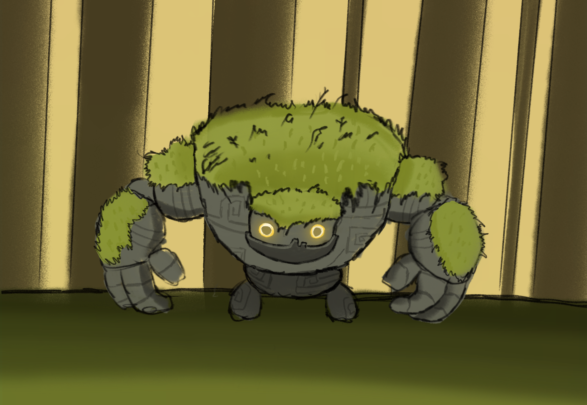

# Mati & Pili

En lo más profundo de una tranquila selva habita Pili, una gigante piedra que custodia la tranquilidad de la naturaleza. Un día, se encuentra con Mati, un niño perdido. Aunque no comparten ni palabras, pronto descubren una gran conexión entre ellos; Pili escucha los pensamientos de Mati, y Mati siente la selva a través de Pili.
Juntos emprenden un viaje para devolver la luz a los santuarios del bosque, apagados por el mundo exterior.

## Índice
1. [Integrantes](#integrantes)
2. [Introducción](#introducción)
3. [Narrativa](#narrativa)
4. [Personajes y mecánicas](#personajes-y-mecánicas)
5. [Escenarios](#escenarios)
6. [Niveles](#niveles)
7. [Progreso del juego](#progreso-del-juego)
8. [Música](#musica)
9. [Referencias](#referencias)

## Integrantes
Grupo 7

| Nombre | Apellidos      | Correos                                                                   | Cuenta github |
|--------|----------------|---------------------------------------------------------------------------|---------------|
| Olga   | de Llano       | [o.dellano.2023@alumnos.urjc.es](mailto:o.dellano.2023@alumnos.urjc.es)   | OlgaDllb      |
| Samuel | Vega de Seoane | [s.vega.2023@alumnos.urjc.es](mailto:s.vega.2023@alumnos.urjc.es)         | samuvds       |
| Ismael | Garcia         | [i.garciaga.2023@alumnos.urjc.es](mailto:i.garciaga.2023@alumnos.urjc.es) | hiper942      |

## Introducción
Género: 
Plataformas cooperativo 2D

Plataforma: 
Web (cooperativo local)

Público objetivo: 
Para todas las edades

Estilo visual: 
Arte 2D con una estética relajada, naturalista y luminosa. Entornos de bosque, con colores suaves, iluminación dorada y detalles ambientales (animales, agua…).

Descripción: 
Mati & Pili es un videojuego de plataformas cooperativo en el cual dos personajes muy distintos entre sí; Mati, un niño curioso y alocado, y Pili, una gigante piedra pacífica; deben avanzar por un bosque mágico resolviendo puzles enfocados en la colaboración, unión de habilidades, altura y tiempo.
El juego combina una lógica, con sincronización y emoción. Se quiere transmitir un mensaje de confianza y unión entre seres diferentes.

Objetivo del diseño: 
Se quiere crear una experiencia cooperativa accesible para todos los públicos, emotiva y visualmente relajada, donde cada nivel sea un pequeño viaje que comparten estos personajes y logre reforzar un vínculo entre los dos jugadores.

## Narrativa
### Tema
Amistad y cooperación + Naturaleza.

### Tono narrativo
Aventurero y emotivo, con una atmósfera llena de serenidad y tranquilidad.
**NO** hay diálogos, sólo gestos, sonidos ambientales y música emocional que logran transmitir la historia.
Página de cómic simulando una cinemática entre niveles, las cuales muestran el crecimiento del vínculo.

### Estructura narrativa
- Encuentro: Mati y Pili se conocen.
- Cooperación: deben superar juntos obstáculos.
- Descubrimiento: empiezan a tener una unión más allá de una simple confianza.
- Separación temporal: un evento los divide.
- Reencuentro y resolución: logran devolver la armonía al bosque.

El final muestra a ambos juntos observando el bosque desde lo alto de un árbol, iluminado de nuevo.

## Personajes y Mecánicas
### Personajes
#### Mati

Mati es un niño elfo, ágil, curioso y un poco imprudente. Representa la energía, la exploración y la agilidad.
Viste una capa naranja, una bandana y pelo recogido en un moño.

#### Pili

Pili es una gigante piedra con ojos brillantes y movimientos lentos pero firmes. Tiene musgo a lo largo de su lomo, y su tamaño triplica el de Mati. Transmite calma y fuerza.

#### Enemigos

Los enemigos no son malvados, sino “criaturas corrompidas” a causa de la falta de luz en el bosque.

##### Tipos:
###### Raíces errantes
Se van arrastrando por el suelo. Pueden atacar a Mati, pero si se sube a Pili estas no le hacen nada a él ni a Pili.

###### Espíritus oscuros
Flotan y bloquean rutas altas; se disipan con la luz del Golpe de naturaleza de Pili.

###### Plantas dormilonas
Actúan como trampas; se abren si Mati pasa rápido, pero no si Pili pasa primero y Mati despacio detrás.

### Mecánicas
Cada jugador controlará un personaje que tendrá mecánicas únicas que se deberán complementar para superar los desafíos.

#### Mati
##### Habilidades
- Salto triple: puede saltar hasta 3 casillas de altura o longitud.
- Impulso: acelera brevemente.
- Montarse sobre Pili: permite alcanzar zonas altas o protección.
- Cooperación de salto: si está sobre Pili, puede impulsarse aún más alto.

##### Limitaciones
- No puede mover objetos grandes.
- Es mucho más vulnerable que Pili.
- No puede nadar, se hunde si no está subido a Pili.

##### Uso de puzles
- Accionar mecanismos a los que Pili no puede llegar gracias a su agilidad.
- Pasar por huecos estrechos.
- Atraer enemigos.

#### Pili
##### Habilidades
- Fuerza bruta: empuja bloques pesados y abre pasajes tapados.
- Salto corto: solo una casilla de altura o longitud.
- Escudo natural: puede proteger a Mati de ataques o proyectiles.
- Plataforma móvil: Mati puede subirse a su lomo.
- Golpe de naturaleza: activa “interruptores” ocultos en la zona.

##### Limitaciones
- Se mueve lentamente.
- No puede pasar por espacios estrechos o pasadizos.
- No puede activar mecanismos complejos de llegar o frágiles.

##### Uso de puzles
- Crear rutas seguras para Mati.
- Sostener interruptores mientras Mati logra su objetivo.
- Formar puentes o escaleras naturales.

## Escenarios

### Ambientación principal
El bosque de Almanza, un entorno natural mágico. Su estética en sí mezcla desde una tranquilidad hasta el misterio, con colores cálidos y vegetación exuberante.

### Diseño visual y sensorial
Luz filtrada por ramas de árboles, reflejos dorados.
Efectos de partículas (luciérnagas, polvo…).
Ríos, troncos caídos, santuarios cubiertos de musgo.

### Estructura del mundo
Cada nivel representa una zona del bosque con un santuario que ha perdido su brillo, el cual debe de activarse de nuevo.
Los niveles se conectan visualmente aparentando un camino seguido, aunque se seleccionan desde un mapa central. Eso sí, se van desbloqueando después de pasar el nivel anterior para seguir una linealidad.

### Progresión ambiental
- Claro del encuentro: naturaleza pacífica, tutorial.
- Puentes de musgo: introducción a los saltos combinados.
- Raíces profundas: puzles de mayor complejidad.
- Cascadas cristalinas: introducción a las mecánicas en agua.
- Templo de la Niebla: cambio de terreno, plataformas ocultas e introducción al Golpe de naturaleza de Pili.
- Eco de las montañas: evolución de saltos combinados.
- Bosque lumínico: espacio nocturno con puzles jugando con las luces.
- Ruinas suspendidas: cooperación aérea.
- Caverna: separación temporal de ambos.
- Santuario del Rocío: reencuentro, espacio en un amanecer y final.

## Niveles
### NIVEL 1 - Claro del Encuentro
- Objetivo: introducción controles básicos.
- Mecánicas: moverse, saltar, subirse a Pili, accionar un interruptor.
- Enemigos: ninguno.
- Ambientación: clara del bosque, luz cálida.
- Emoción: primera unión.

### NIVEL 2 - Puentes de musgo
- Objetivo: introducción al salto triple de Mati.
- Mecánicas: salto triple de Mati.
- Puzle: Mati debe accionar un puente para Pili.
- Enemigos: raíces errantes.

### NIVEL 3 - Raíces profundas
- Objetivo: mayor unión entre jugadores.
- Puzle: ambos deben accionar placas a la vez.
- Enemigos: plantas dormilonas.

### NIVEL 4 - Cascadas cristalinas
- Objetivo: introducción a mecánicas en agua.
- Mecánicas: Pili como plataforma para Mati en aguas profundas.
- Puzle: abrir paso entre las cascadas para Mati con Pili.
- Ambientación: cascadas brillantes gigantes con sus respectivos riachuelos.

### NIVEL 5 - Templo de la Niebla
- Objetivo: introducción a la mecánica de visibilidad con el Golpe de Naturaleza de Pili y cooperación para iluminar el camino.
- Mecánicas: Golpe de Naturaleza de Pili.
- Enemigos: espíritus oscuros.
- Ambientación: templo oscuro pero manteniendo la magia del bosque.

### NIVEL 6 - Eco de las montañas
- Objetivo: mayor unión entre jugadores mediante una mayor complejidad de parkour.
- Enemigos: raíces errantes y espíritus oscuros. 
- Ambientación: montañas altas con su brillo mágico en el anochecer.
- Emoción: en el nivel se empieza a ver el progreso de devolver la luz al bosque, sensación de que la unión de los jugadores tiene sus resultados.

### NIVEL 7 - Bosque lumínico
- Objetivo: introducción a puzles con luces.
- Enemigos: plantas dormilonas.
- Ambientación: parte del bosque en la noche con una magia especial.
- Emoción: serenidad y madurez emocional del viaje.

### NIVEL 8 - Ruinas suspendidas
- Objetivo: introducción a parkour flotante.
- Mecánicas: Pili puede lanzar a Mati a plataformas lejanas.
- Enemigos: espíritus oscuros.
- Emoción: riesgo y confianza.

### NIVEL 9 - Caverna
- Objetivo: que los jugadores logren avanzar por su cuenta, control alternado.
- Enemigos: todos.
- Ambientación: cueva oscura con setas luminiscentes que van iluminando el camino.
- Emoción: confianza en el otro cuando uno no está presente.

### NIVEL 10 - Santuario del Rocío
- Objetivo: encender de nuevo el último santuario.
- Enemigos: todos.
- Ambientación: parte del bosque más sagrado al amanecer.
- Emoción: volver a ver el bosque con su verdadera luz.
- Cinemática final del bosque restaurado.

## Progreso del juego
### Sistema de avance
Cada nivel completado activa un nuevo santuario. El progreso se ve en el mapa central a medida que se pasan los niveles, se observa cómo vuelve la luz por las zonas que se han pasado. Sistema simple de selección de nivel desbloqueado.

### Guardado
Guardado automático tras cada nivel. 

### Aprendizaje
Cada nivel introduce una nueva mecánica, combinación de las mismas, nuevo terreno o nuevas sensaciones:
Movimiento.
Saltos y peso.
Seguridad e interruptores dobles.
Sincronización y consciencia.
Luz y visibilidad.
Aumento de dificultad.
Juego con luces.
Lanzamiento.
Separación.
Unión final.

### Diagrama de flujo

### Dificultad
En escala suave. La curva de aprendizaje se apoya en la cooperación de ambos más que en la misma complejidad en parkour o puzles.

### Rejugabilidad
La experiencia emocional es distinta dependiendo de con quién se juegue.

## Musica
-Aqui escribes belath-
## Referencias
- [Nunu y Willump](https://www.leagueoflegends.com/es-es/champions/nunu/)
- [Masha y el oso](https://es.wikipedia.org/wiki/Masha_y_el_oso_(serie_de_televisi%C3%B3n))
- [Sully y Boo](https://www.reddit.com/r/Pixar/comments/1eizi3p/sully_and_boo/?tl=es-es)
- [Resto de referencias](https://es.pinterest.com/samu_vds/mati-y-pilii/)
